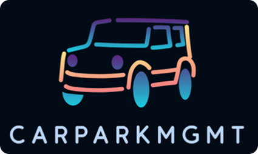
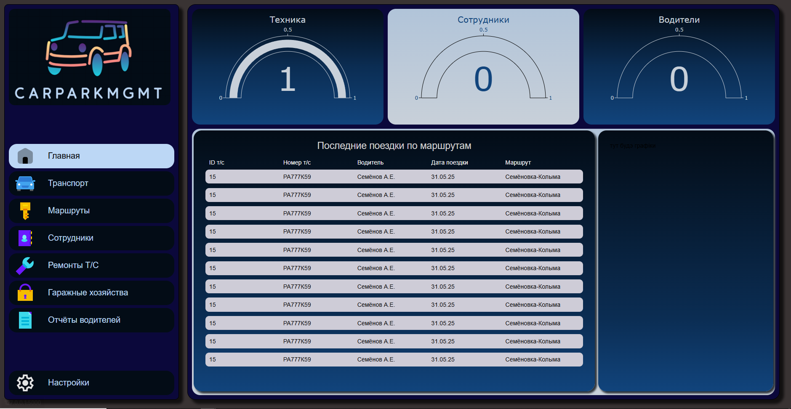

<a id="readme-top"></a>
[![LICENSE][license-shield]](LICENSE)


<div align="center">
  <a href="https://github.com/buksnet/CarParkMGMT">
    
  </a>
<h3 align="center">CarParkMGMT</h3>

  <p align="center">
    Проект для курсовой работы по курсу "Базы Данных"
<br />
    Приложение для управления автопарком.
    <br />
    <a href="https://github.com/buksnet/CarParkMGMT">Изучить проект</a>
    &middot;
    <a href="https://github.com/buksnet/CarParkMGMT/issues/new?labels=bug&template=bug-report---.md">Сообщить о баге</a>
    &middot;
    <a href="https://github.com/buksnet/CarParkMGMT/issues/new?labels=enhancement&template=feature-request---.md">Запросить фичу</a>
  </p>
</div>

<details>
  <summary>Содержание</summary>
  <ol>
    <li>
      <a href="#about-the-project">О проекте</a>
      <ul>
        <li><a href="#built-with">Использованные технологии</a></li>
      </ul>
    </li>
    <li>
      <a href="#getting-started">Начало работы</a>
      <ul>
        <li><a href="#preparations">Подготовка</a></li>
        <li><a href="#launch">Запуск</a></li>
      </ul>
    </li>
    <li><a href="#contribution">Участие в разработке</a></li>
    <li><a href="#license">Лицензии</a></li>
    <li><a href="#contact">Связь</a></li>
    <li><a href="#acknowledgments">Разработчики</a></li>
  </ol>
</details>


<a id="about-the-project"></a>
## О проекте



<a id="built-with"></a>
### Создано с применением технологий:

* 
* 
* 
* 
* 
* 
* 
* 

<p align="right">(<a href="#readme-top">к началу страницы</a>)</p>


<a id="getting-started"></a>
## Начало использования

<a id="preparations"></a>
### Подготовка

Установка зависимостей приложения
* pip
  ```sh
  pip install -r "requirements.txt"
  ```
<a id="launch"></a>
### Запуск проекта
* flask
    ```sh
    flask --app run
    ```
  
<a id="contribution"></a>
## Участие в проекте

Для участия в проекте следует следовать данной инструкции:

1. Форкнуть проект
2. Создать ветку для вашей фичи (`git checkout -b feature/AmazingFeature`)
3. Закоммитить ваши изменения (`git commit -m 'Add some AmazingFeature'`)
4. Спушить фичу в репозиторий (`git push main feature/AmazingFeature`)
5. Открыть Pull Request

<p align="right">(<a href="#readme-top">к началу страницы</a>)</p>


<a id="license"></a>
## Лицензия

Описана в файле LICENSE. См. [LICENSE.txt](LICENSE).

<p align="right">(<a href="#readme-top">к началу страницы</a>)</p>


<a id="contact"></a>
## Связь

buksnet - [@TypicalGeek](https://t.me/TypicalGeek)

Project Link: [https://github.com/buksnet/CarParkMGMT](https://github.com/buksnet/CarParkMGMT)


<a id="acknowledgments"></a>
### Главные разработчики:

<a href="https://github.com/buksnet/CarParkMGMT/graphs/contributors">
  
</a>

<p align="right">(<a href="#readme-top">к началу страницы</a>)</p>
